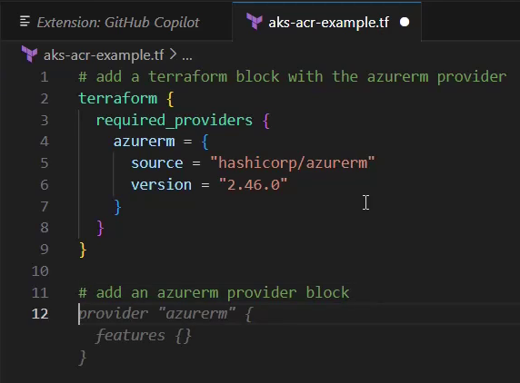

# 1. Introduction

This example of a Terraform configuration file shows, which dedicated comments I have used for getting suggestions from the GitHub Copilot.
The goal was to create a final configuration file, which allows to deploy a Kubernetes cluster and an attached Container Registry on Azure.

For a more detailed manual please see the related blog post:

https://www.patrickkoch.dev/posts/post_31/

# 2. Prerequisites
 * [Visual Studio Code](https://code.visualstudio.com/) 
 * [GitHub Copilot Extension](https://marketplace.visualstudio.com/items?itemName=GitHub.copilot) (see picture below)
 * [GitHub Copilot subscription](https://github.com/features/copilot)
 * [Terraform](https://www.terraform.io/)
 * [Azure subscription](https://azure.microsoft.com/en-us)


# 3. Get suggestions from GitHub Copilot and create the Terrafrom configuration file





``` powershell
terraform validate
```

# 4. Create the resources by applying the Terraform configuration

## 5. Destroy the resources

Use the following command to delete all provisioned resources again:

``` powershell
terraform destroy
```
