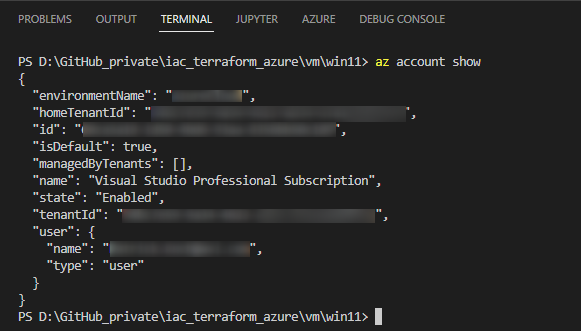

# 1. Introduction

This is intended for those who would like to provision a Windows 11 Virtual Machine using Terraform.

# 2. Prerequisites
 - [Azure CLI](https://learn.microsoft.com/en-us/cli/azure/install-azure-cli)
 - [Terraform](https://developer.hashicorp.com/terraform/downloads)
 - [Git (for Windows)](https://gitforwindows.org/)

# 3. Preparing the environment

## 3.1 Login to your Azure Subscription with Azure CLI

At first, login to your Azure subscription by opening e.g.: a PowerShell prompt or opening a Terminal in Visual Studio Code and run:

```
az login
```


A browser session will be opened, enter the credentials for your account.
Ensure, that the desired subscription is properly set by applying:

```
az account show
```
In the output you should see your subscription of choice. In my case, I'm using my Visual Studio subscription:



## 3.2 Clone this repository

Clone this repository by running following git command:

```
git clone https://github.com/patkoch/iac_terraform_azure.git
```

After cloning it, switch to the directory "iac_terraform_azure/vm/win11"

# 4. Provisioning and destroying the resources with Terraform

## Creating the Windows 11 Virtual Machine with Terraform

Conduct the initialization with following command:

```
terraform init
```

This will establish a connection to the backend.

After that, run:

```
terraform validate
```

This validates the configuration file.

Formate your Terraform configuration by using:

```
terraform fmt
```

This takes care, that your files are formated properly. It will e.g. correct the shifting of your resource blocks.
If e.g. a resource block was shifted, than the command returns the name of the file, which contained the resource block.

Create a Terraform plan by running:

```
terraform plan -out tfplan
```

This creates the file "tfplan". If the resources are getting created for the very first time, then the following command would be:

```
terraform apply tfplan
```
This provisions a Windows Virtual Machine in your *Azure* subscription.

Note:
Assume, the resources are already created and you would run following command again:

```
terraform plan -out tfplan
```

In that case you would get notified, that there are no changes.


# References

[HashiCorp: Tutorials - Get Started - Azure](https://developer.hashicorp.com/terraform/tutorials/azure-get-started)